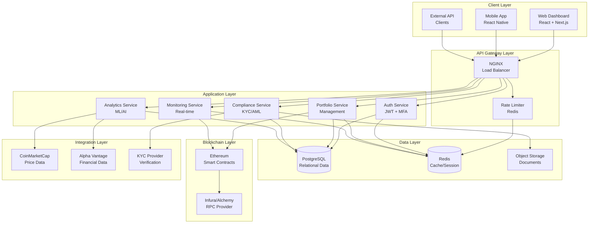
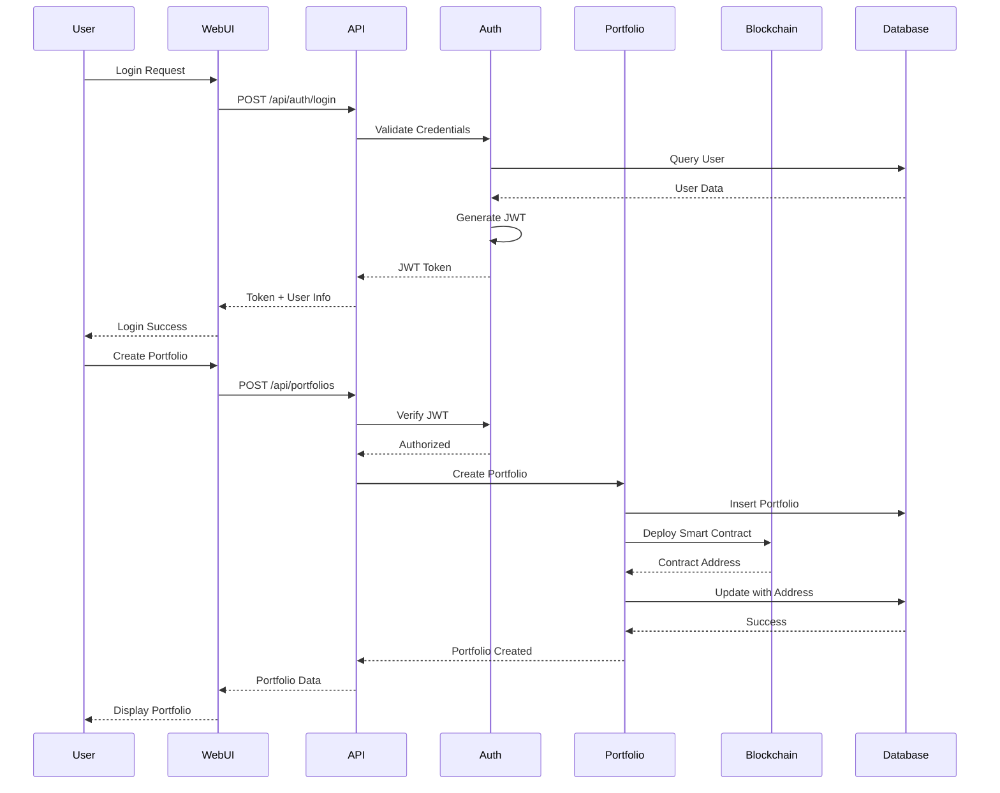
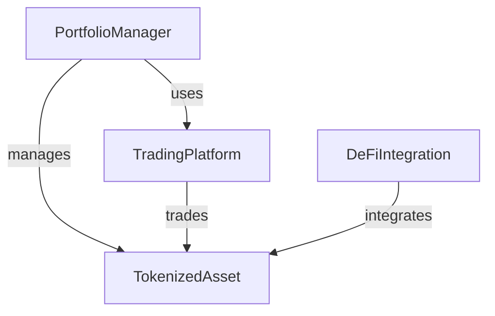
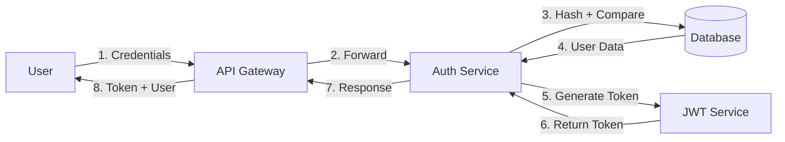
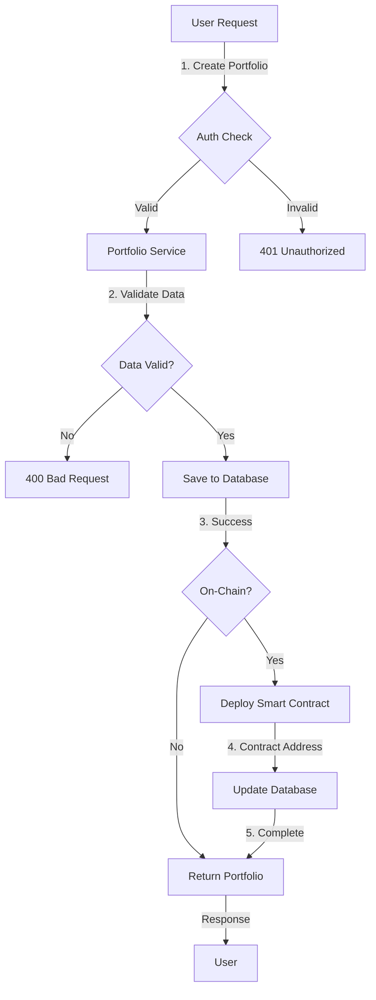
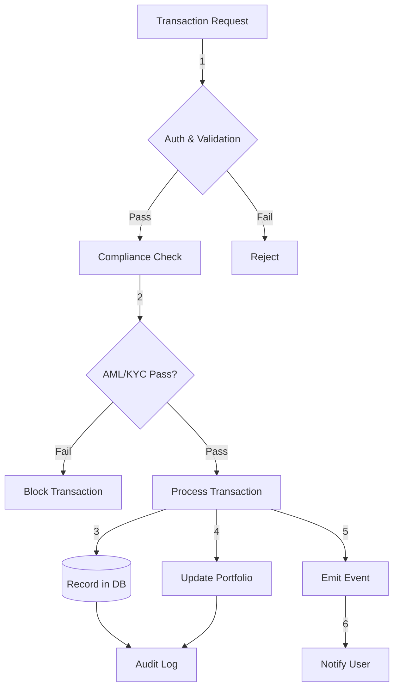
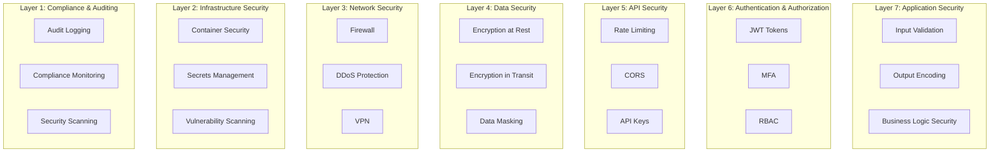
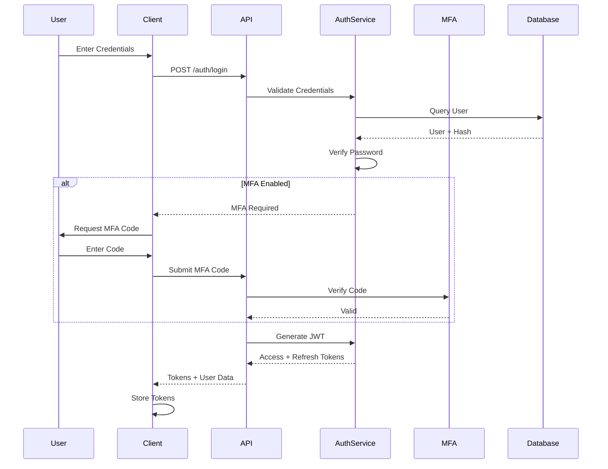

# Architecture Documentation

System architecture and component design for BlockGuardian platform.

## Table of Contents

- [Overview](#overview)
- [System Architecture](#system-architecture)
- [Component Architecture](#component-architecture)
- [Data Flow](#data-flow)
- [Technology Stack](#technology-stack)
- [Security Architecture](#security-architecture)
- [Deployment Architecture](#deployment-architecture)
- [Module Mapping](#module-mapping)

## Overview

BlockGuardian follows a modern, modular, microservices-inspired architecture designed for scalability, security, and maintainability. The platform consists of multiple independent but interconnected components that communicate via well-defined APIs.

### Design Principles

1. **Separation of Concerns**: Each component has a single, well-defined responsibility
2. **Scalability**: Horizontal scaling through containerization and orchestration
3. **Security by Design**: Multiple layers of security at every level
4. **Data Integrity**: Blockchain for immutable records, database for flexibility
5. **Observability**: Comprehensive logging, monitoring, and tracing
6. **API-First**: RESTful APIs with clear contracts
7. **Modularity**: Independent deployment and versioning of components

## System Architecture

### High-Level Architecture



### Component Interaction Diagram



## Component Architecture

### Backend Service Architecture

```
code/backend/src/
├── main.py                    # Application factory, entry point
├── config.py                  # Configuration management
├── logging_config.py          # Logging setup
│
├── models/                    # Data models and business logic
│   ├── base.py               # Database base classes
│   ├── user.py               # User model
│   ├── portfolio.py          # Portfolio model
│   ├── portfolio_advanced.py # Advanced portfolio operations
│   ├── transaction.py        # Transaction model
│   └── ai_models.py          # ML/AI models
│
├── routes/                    # API endpoints
│   ├── auth.py               # Authentication endpoints
│   ├── portfolio.py          # Portfolio endpoints
│   └── user.py               # User management endpoints
│
├── security/                  # Security components
│   ├── auth.py               # Authentication logic
│   ├── encryption.py         # Data encryption
│   ├── rate_limiting.py      # Rate limiting
│   ├── validation.py         # Input validation
│   └── audit.py              # Audit logging
│
├── compliance/                # Compliance features
│   ├── compliance.py         # KYC/AML logic
│   └── reporting.py          # Compliance reporting
│
├── monitoring/                # Monitoring and metrics
│   └── metrics.py            # Metrics collection
│
└── database/                  # Database utilities
    └── init_db.py            # Database initialization
```

### Frontend Architecture

```
web-frontend/
├── pages/                     # Next.js pages (routes)
│   ├── index.jsx             # Home page
│   ├── login.jsx             # Login page
│   ├── dashboard.jsx         # Main dashboard
│   ├── portfolios/
│   │   ├── index.jsx         # Portfolio list
│   │   └── [id].jsx          # Portfolio details
│   ├── trade.jsx             # Trading interface
│   └── settings.jsx          # User settings
│
├── components/                # Reusable components
│   ├── Portfolio/            # Portfolio components
│   ├── Auth/                 # Authentication components
│   ├── Charts/               # Chart components
│   └── Layout/               # Layout components
│
├── services/                  # API services
│   ├── api.js                # API client
│   ├── blockchain.js         # Blockchain interactions
│   └── auth.js               # Authentication service
│
├── utils/                     # Utility functions
│   ├── formatters.js         # Data formatters
│   ├── validators.js         # Input validators
│   └── helpers.js            # Helper functions
│
└── styles/                    # Styling
    ├── globals.css           # Global styles
    └── components/           # Component styles
```

### Smart Contract Architecture

```
code/blockchain/contracts/
├── PortfolioManager.sol       # Portfolio management
├── TradingPlatform.sol        # Trading logic
├── TokenizedAsset.sol         # ERC20 assets
├── DeFiIntegration.sol        # DeFi protocol integration
└── TestToken.sol              # Test token for development
```

**Contract Relationships:**



## Data Flow

### User Authentication Flow



### Portfolio Creation Flow



### Transaction Processing Flow



## Technology Stack

### Backend Stack

| Layer             | Technology     | Purpose                  | File Location                       |
| ----------------- | -------------- | ------------------------ | ----------------------------------- |
| Web Framework     | Flask 3.1.1    | HTTP server, routing     | `code/backend/src/main.py`          |
| Database ORM      | SQLAlchemy 2.0 | Database abstraction     | `code/backend/src/models/base.py`   |
| Database          | PostgreSQL 13+ | Relational data storage  | N/A (external)                      |
| Cache             | Redis 6+       | Session storage, caching | N/A (external)                      |
| Authentication    | JWT            | Token-based auth         | `code/backend/src/security/auth.py` |
| Task Queue        | Celery         | Background jobs          | `code/backend/src/`                 |
| API Documentation | Flasgger       | Swagger/OpenAPI          | `code/backend/src/main.py`          |

### Frontend Stack

| Layer            | Technology      | Purpose                | File Location                         |
| ---------------- | --------------- | ---------------------- | ------------------------------------- |
| Framework        | Next.js 13+     | React framework        | `web-frontend/`                       |
| UI Library       | React 18+       | Component library      | `web-frontend/pages/`                 |
| State Management | Redux Toolkit   | Global state           | `web-frontend/store/`                 |
| Styling          | Tailwind CSS    | Utility-first CSS      | `web-frontend/styles/`                |
| Charts           | D3.js, Recharts | Data visualization     | `web-frontend/components/Charts/`     |
| Web3             | ethers.js       | Blockchain interaction | `web-frontend/services/blockchain.js` |

### Blockchain Stack

| Layer           | Technology      | Purpose              | File Location                       |
| --------------- | --------------- | -------------------- | ----------------------------------- |
| Smart Contracts | Solidity 0.8.19 | Contract development | `code/blockchain/contracts/`        |
| Development     | Hardhat         | Testing, deployment  | `code/blockchain/hardhat.config.js` |
| Libraries       | OpenZeppelin    | Security, standards  | `code/blockchain/contracts/`        |
| Testing         | Hardhat, Chai   | Contract testing     | `code/blockchain/test/`             |
| Provider        | Infura/Alchemy  | Ethereum node access | Configuration                       |

## Security Architecture

### Security Layers



### Authentication Flow



## Deployment Architecture

### Development Environment

```
┌─────────────────────────────────────────────┐
│          Developer Workstation              │
│                                             │
│  ┌──────────┐  ┌──────────┐  ┌──────────┐ │
│  │ Backend  │  │ Frontend │  │Blockchain│ │
│  │localhost │  │localhost │  │ Hardhat  │ │
│  │  :5000   │  │  :3000   │  │  :8545   │ │
│  └──────────┘  └──────────┘  └──────────┘ │
│       │              │              │      │
│       └──────────────┴──────────────┘      │
│                     │                      │
│            ┌────────┴────────┐            │
│            │   SQLite / Redis │            │
│            └──────────────────┘            │
└─────────────────────────────────────────────┘
```

### Production Environment (Kubernetes)

```
┌─────────────────────────────────────────────────────────┐
│                    Load Balancer                        │
│                   (AWS ALB / GCP LB)                    │
└────────────────────┬────────────────────────────────────┘
                     │
┌────────────────────┴────────────────────────────────────┐
│              Kubernetes Cluster (EKS/GKE)               │
│                                                          │
│  ┌─────────────────────────────────────────────────┐   │
│  │         Ingress Controller (NGINX)              │   │
│  └────────────────┬────────────────────────────────┘   │
│                   │                                     │
│  ┌────────────────┴────────────────────────────────┐   │
│  │              Service Mesh (Istio)               │   │
│  └────────────────┬────────────────────────────────┘   │
│                   │                                     │
│  ┌────────────────┴────────────────────┐               │
│  │                                     │               │
│  │  ┌──────────┐      ┌──────────┐   │               │
│  │  │ Backend  │      │ Backend  │   │               │
│  │  │  Pod 1   │      │  Pod 2   │   │               │
│  │  └──────────┘      └──────────┘   │               │
│  │                                     │               │
│  │  ┌──────────┐      ┌──────────┐   │               │
│  │  │ Frontend │      │ Frontend │   │               │
│  │  │  Pod 1   │      │  Pod 2   │   │               │
│  │  └──────────┘      └──────────┘   │               │
│  └─────────────────────────────────────┘               │
│                                                          │
│  ┌──────────────────────────────────────────────────┐  │
│  │         Persistent Storage (EBS/PD)              │  │
│  │  ┌────────────┐  ┌────────┐  ┌────────────────┐ │  │
│  │  │ PostgreSQL │  │ Redis  │  │ Object Storage │ │  │
│  │  │   (RDS)    │  │(Elastic│  │     (S3/GCS)   │ │  │
│  │  │            │  │ Cache) │  │                │ │  │
│  │  └────────────┘  └────────┘  └────────────────┘ │  │
│  └──────────────────────────────────────────────────┘  │
│                                                          │
└──────────────────────────────────────────────────────────┘

┌──────────────────────────────────────────────────────────┐
│         Monitoring & Logging Infrastructure              │
│  ┌──────────┐  ┌──────────┐  ┌──────────┐             │
│  │Prometheus│  │ Grafana  │  │   ELK    │             │
│  │          │  │          │  │  Stack   │             │
│  └──────────┘  └──────────┘  └──────────┘             │
└──────────────────────────────────────────────────────────┘
```

## Module Mapping

### Backend Modules to Files

| Module/Component    | File Path                                       | Description                 |
| ------------------- | ----------------------------------------------- | --------------------------- |
| Application Factory | `code/backend/src/main.py`                      | Flask app initialization    |
| Configuration       | `code/backend/src/config.py`                    | Environment-specific config |
| Database Manager    | `code/backend/src/models/base.py`               | Database connection pooling |
| User Model          | `code/backend/src/models/user.py`               | User entity and operations  |
| Portfolio Model     | `code/backend/src/models/portfolio.py`          | Basic portfolio operations  |
| Advanced Portfolio  | `code/backend/src/models/portfolio_advanced.py` | Analytics, rebalancing      |
| Transaction Model   | `code/backend/src/models/transaction.py`        | Transaction logging         |
| AI Models           | `code/backend/src/models/ai_models.py`          | ML/AI predictions           |
| Auth Routes         | `code/backend/src/routes/auth.py`               | Authentication endpoints    |
| Portfolio Routes    | `code/backend/src/routes/portfolio.py`          | Portfolio endpoints         |
| User Routes         | `code/backend/src/routes/user.py`               | User management endpoints   |
| Auth Manager        | `code/backend/src/security/auth.py`             | JWT, session management     |
| Encryption          | `code/backend/src/security/encryption.py`       | Data encryption utilities   |
| Rate Limiter        | `code/backend/src/security/rate_limiting.py`    | API rate limiting           |
| Input Validation    | `code/backend/src/security/validation.py`       | Request validation          |
| Audit Logger        | `code/backend/src/security/audit.py`            | Security audit logging      |
| Compliance Service  | `code/backend/src/compliance/compliance.py`     | KYC/AML logic               |
| Reporting           | `code/backend/src/compliance/reporting.py`      | Compliance reports          |
| Metrics Collector   | `code/backend/src/monitoring/metrics.py`        | Prometheus metrics          |

### Frontend Modules to Files

| Module/Component     | File Path                                 | Description              |
| -------------------- | ----------------------------------------- | ------------------------ |
| Dashboard            | `web-frontend/pages/dashboard.jsx`        | Main dashboard page      |
| Portfolio List       | `web-frontend/pages/portfolios/index.jsx` | Portfolio listing        |
| Portfolio Detail     | `web-frontend/pages/portfolios/[id].jsx`  | Portfolio details        |
| Login Page           | `web-frontend/pages/login.jsx`            | Authentication page      |
| API Service          | `web-frontend/services/api.js`            | HTTP client wrapper      |
| Blockchain Service   | `web-frontend/services/blockchain.js`     | Web3 interactions        |
| Auth Service         | `web-frontend/services/auth.js`           | Auth utilities           |
| Portfolio Components | `web-frontend/components/Portfolio/`      | Portfolio UI components  |
| Chart Components     | `web-frontend/components/Charts/`         | Visualization components |

### Smart Contract Modules to Files

| Contract          | File Path                                        | Description                   |
| ----------------- | ------------------------------------------------ | ----------------------------- |
| Portfolio Manager | `code/blockchain/contracts/PortfolioManager.sol` | On-chain portfolio management |
| Trading Platform  | `code/blockchain/contracts/TradingPlatform.sol`  | Decentralized trading         |
| Tokenized Asset   | `code/blockchain/contracts/TokenizedAsset.sol`   | ERC20 token implementation    |
| DeFi Integration  | `code/blockchain/contracts/DeFiIntegration.sol`  | DeFi protocol integration     |
| Deployment Script | `code/blockchain/scripts/deploy.js`              | Contract deployment           |

## Performance Considerations

### Caching Strategy

```
┌──────────────┐
│   Request    │
└──────┬───────┘
       │
       ▼
┌──────────────┐    Cache Miss    ┌──────────────┐
│    Redis     │──────────────────▶│  Database    │
│    Cache     │                   │   Query      │
└──────┬───────┘◀──────────────────└──────────────┘
       │           Update Cache
       │
       ▼
┌──────────────┐
│   Response   │
└──────────────┘
```

**Cache Layers:**

1. **Browser Cache**: Static assets, API responses (short TTL)
2. **CDN Cache**: Frontend assets, images
3. **Redis Cache**: Session data, frequently accessed data
4. **Database Query Cache**: Complex query results

### Scaling Strategy

**Horizontal Scaling:**

- Backend: Multiple Flask instances behind load balancer
- Frontend: Multiple Next.js instances via CDN
- Database: Read replicas for scaling reads
- Redis: Redis Cluster for distributed caching

**Vertical Scaling:**

- Database: Larger instance sizes for complex queries
- ML Services: GPU instances for AI/ML workloads

## Next Steps

- Review [Feature Matrix](FEATURE_MATRIX.md) for detailed feature breakdown
- Check [Configuration](CONFIGURATION.md) for component configuration
- See [API Documentation](API.md) for endpoint details
- Read [CLI Reference](CLI.md) for deployment commands
